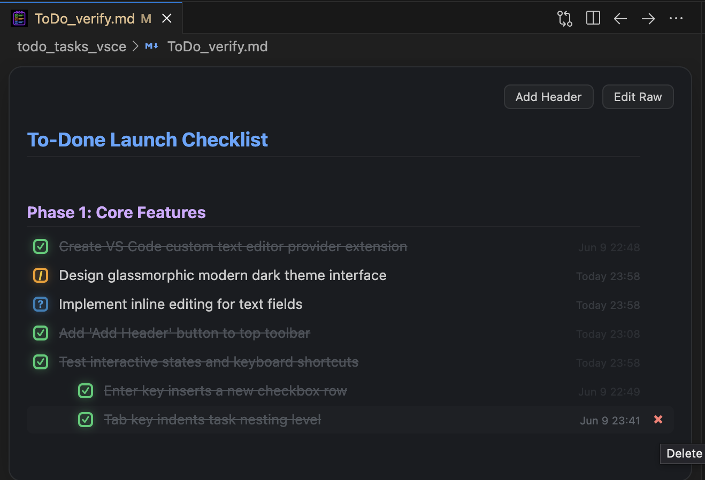

# NexDo VS Code Extension

**NexDo** is an interactive, glassmorphic todo list editor for Markdown task files. It automatically registers as the default editor for any Markdown files matching the pattern `**/todo*.md` or `**/ToDo*.md` (e.g. `todo.md`, `ToDo_tasks.md`, `Todo.md`).



## Features

- **Add Header Button**:
  - Click **Add Header** at the top toolbar to turn the current line into a markdown `# Header` row without a checkbox.
  - Automatically preserves existing text if present; otherwise, defaults to `"Header"` if the line is empty.
- **Interactive Checkboxes**:
  - **Single Click**: Cycles through checkbox states: **Pending (`[ ]`)** -> **In Progress (`[/]`)** -> **Completed (`[x]`)**.
  - **Doubt State (`[?]`)**: Use `Alt + Click` (or Option + Click) to mark a task as **Doubt / Question (`[?]`)** with a glowing blue state.
- **Inline Editing**: Click any line of text directly to edit it. The changes will instantly save back to the underlying `.md` file.
- **Enter to Add Row**: Pressing `Enter` adds a new checkbox row directly below, matching the current line's indentation.
- **Tab to Indent (Nest)**: Press `Tab` on a task to indent/nest it, or `Shift + Tab` to outdent/unnest it.
- **Auto-Save**: The extension automatically saves the file immediately after any toggle, edit, insertion, or deletion.
- **Custom Icon**: Displays the custom checklist icon in the file tabs and in the VS Code Marketplace.

---

## Testing the Extension Locally

You can test the extension locally using one of the following two methods:

### Method 1: Run via Extension Development Host (Recommended for Development)

1. Open the project folder `todo_tasks_vsce` in VS Code or Cursor.
2. Open the **Run and Debug** view (`Ctrl+Shift+D` or `Cmd+Shift+D`).
3. If no configuration exists, click "create a launch.json file" and choose "Extension Development". If it's already set up, select **Run Extension** (or press **`F5`**).
4. A new VS Code window (the "Extension Development Host") will open with the extension pre-loaded.
5. In this new window, open or create a file named `ToDo_test.md` (e.g. containing `- [ ] My Task`).
6. It will automatically open in the **NexDo** interactive editor!
7. *Tip: You can right-click the file tab and select "Open With..." -> "Text Editor" to view or edit the raw markdown and see it sync in real-time.*

### Method 2: Package and Install Locally (As a .vsix File)

To test the extension as an installed package:
1. Open your terminal inside the project directory `/Users/theBhat/Documents/code/todo_tasks_vsce`.
2. Package the extension into a `.vsix` file by running:
   ```bash
   npx @vscode/vsce package
   ```
3. This creates a file named `nexdo-1.0.0.vsix` in the directory.
4. Install this extension into your active VS Code/Cursor editor using:
   ```bash
   code --install-extension nexdo-1.0.0.vsix
   ```
   *(If you are using Cursor, replace `code` with `cursor` in the command).*
5. Restart or reload your editor.

---

## Publishing to the Visual Studio Code Marketplace

To publish the extension so anyone can install it, follow these steps:

### Step 1: Create a Marketplace Publisher
1. Go to the [Visual Studio Marketplace Management Portal](https://marketplace.visualstudio.com/manage).
2. Log in with your Microsoft account.
3. Click **Create Publisher** and fill in your details:
   - **Publisher ID**: Use a unique ID (e.g. `aditya-bhat`).
   - **Display Name**: `Aditya Bhat`.

### Step 2: Package the Extension
Make sure your extension is packaged into a `.vsix` file:
1. Open your terminal inside the project directory.
2. Run:
   ```bash
   npx @vscode/vsce package
   ```
3. This creates a file named `nexdo-1.0.0.vsix` in the directory.

### Step 3: Upload Manually via Web Portal
1. Open the [Visual Studio Marketplace Management Portal](https://marketplace.visualstudio.com/manage).
2. Click on your publisher name (e.g. `Aditya Bhat`).
3. Click the **New Extension** button and choose **Visual Studio Code**.
4. Drag and drop the packaged `nexdo-1.0.0.vsix` file.
5. Click **Upload**. Your extension will undergo a quick automated check and then become publicly available.
